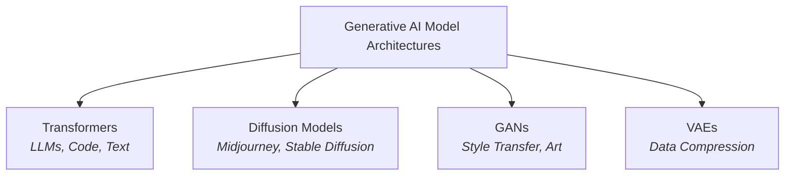
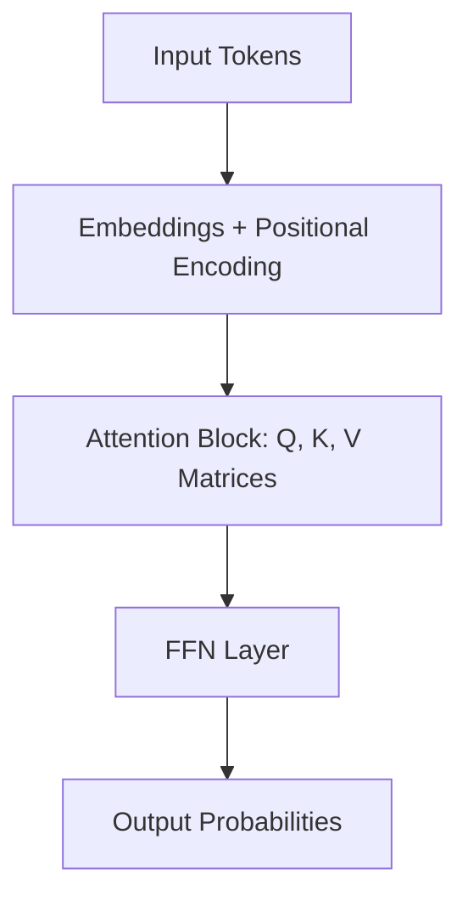

# Aim:	Comprehensive Report on the Fundamentals of Generative AI and Large Language Models (LLMs)
Experiment:
Develop a comprehensive report for the following exercises:
1.	Explain the foundational concepts of Generative AI. 
2.	Focusing on Generative AI architectures. (like transformers).
3.	Generative AI applications.
4.	Generative AI impact of scaling in LLMs.

# Algorithm: Step 1: Define Scope and Objectives
1.1 Identify the goal of the report (e.g., educational, research, tech overview)
1.2 Set the target audience level (e.g., students, professionals)
1.3 Draft a list of core topics to cover
Step 2: Create Report Skeleton/Structure
2.1 Title Page
2.2 Abstract or Executive Summary
2.3 Table of Contents
2.4 Introduction
2.5 Main Body Sections:
•	Introduction to AI and Machine Learning
•	What is Generative AI?
•	Types of Generative AI Models (e.g., GANs, VAEs, Diffusion Models)
•	Introduction to Large Language Models (LLMs)
•	Architecture of LLMs (e.g., Transformer, GPT, BERT)
•	Training Process and Data Requirements
•	Use Cases and Applications (Chatbots, Content Generation, etc.)
•	Limitations and Ethical Considerations
•	Future Trends
2.6 Conclusion
2.7 References
________________________________________
Step 3: Research and Data Collection
3.1 Gather recent academic papers, blog posts, and official docs (e.g., OpenAI, Google AI)
3.2 Extract definitions, explanations, diagrams, and examples
3.3 Cite all sources properly
________________________________________
Step 4: Content Development
4.1 Write each section in clear, simple language
4.2 Include diagrams, figures, and charts where needed
4.3 Highlight important terms and definitions
4.4 Use examples and real-world analogies for better understanding
________________________________________
Step 5: Visual and Technical Enhancement
5.1 Add tables, comparison charts (e.g., GPT-3 vs GPT-4)
5.2 Use tools like Canva, PowerPoint, or LaTeX for formatting
5.3 Add code snippets or pseudocode for LLM working (optional)
________________________________________
Step 6: Review and Edit
6.1 Proofread for grammar, spelling, and clarity
6.2 Ensure logical flow and consistency
6.3 Validate technical accuracy
6.4 Peer-review or use tools like Grammarly or ChatGPT for suggestions
________________________________________
Step 7: Finalize and Export
7.1 Format the report professionally
7.2 Export as PDF or desired format
7.3 Prepare a brief presentation if required (optional)


# Output
# Prompt:
## 1. Foundational Concepts & Model Trade-offs

Act as an AI researcher and educator. Explain the foundational concepts of Generative AI and analyze how different model scales (small vs. large models) affect performance across Accuracy, Creativity, Hallucination, Reasoning, and Speed. Break down each of these 5 core evaluation metrics in detail—defining what they mean, how they are measured, and why trade-offs exist between them (e.g., speed vs. reasoning depth, or creativity vs. factual accuracy). Structure the explanation using clear Markdown headings, comparison tables, and beginner-friendly examples suitable for computer science students.

## 2. Architectures & Core Performance Drivers

Act as a Generative AI architect. Compare the major AI architectures—Transformers, Generative Adversarial Networks (GANs), Variational Autoencoders (VAEs), and Diffusion Models—specifically through the lens of Accuracy, Creativity, Hallucination, Reasoning, and Speed. Explain how the structural design of each architecture influences its performance on these five parameters (e.g., why Diffusion models excel at creative visual fidelity but struggle with speed compared to GANs, or why Transformers excel at reasoning). Include a comprehensive comparison matrix table and format the response in clean Markdown for a technical architecture report.

## 3. System Pipeline & Parameter Controls

Act as a Lead AI Systems Engineer. Explain how the complete Generative AI system workflow—from data collection, tokenization, pre-training, RAG integration, to fine-tuning and inference—directly impacts Accuracy, Creativity, Hallucination, Reasoning, and Speed. Detail how specific runtime knobs and optimization techniques (such as temperature settings, top-p sampling, quantization, KV-caching, and guardrails) alter these 5 dimensions. Use structured Markdown with step-by-step breakdowns, code/parameter examples, and practical guidance for balancing latency against accuracy in production deployments.

## 4. Impact of Scaling on Evaluation Metrics

Act as an LLM Research Scientist. Analyze the impact of scaling (parameters, training compute, context length, and inference-time compute) on the 5 key LLM evaluation parameters: Accuracy, Creativity, Hallucination, Reasoning, and Speed. Explain why increasing parameter scale non-linearly boosts reasoning ability and accuracy while reducing baseline hallucination rates, but introduces significant speed (latency) bottlenecks. Include a detailed scaling vs. performance trade-off table and format the explanation in concise Markdown tailored for senior engineering students and developers.

## 5. Building LLMs & Evaluating Output Quality

Act as an AI Systems & Evaluation Engineer. Walk through the complete pipeline of building a Large Language Model (from pre-training to RLHF and deployment) and explain how each stage is designed to optimize Accuracy, Creativity, Hallucination, Reasoning, and Speed. Detail the specific evaluation benchmarks used to test each parameter (e.g., MMLU for accuracy, HumanEval/MATH for reasoning, TruthfulQA for hallucination, and TTFT/TPS for speed). Present the response as a comprehensive technical guide in Markdown with numbered workflow steps, evaluation criteria tables, and real-world trade-off scenarios.


# Perplexity: 
# 1. Explain the foundational concepts of Generative AI

Generative AI is a type of artificial intelligence that learns patterns from existing data and creates new content that resembles that data. It can generate text, images, audio, code, video, and more.

---

## Foundational Concepts

* **Learning from data:** Generative AI systems are trained on large datasets so they can recognize structure, style, and relationships.
* **Pattern generation:** Instead of only classifying or predicting labels, they produce new outputs based on learned patterns.
* **Probabilistic modeling:** These models estimate what is most likely to come next in a sequence, such as the next word in a sentence or the next pixel in an image.
* **Input prompt:** A user provides a prompt, and the model generates a response based on that instruction.
* **Training and inference:** During training, the model learns from data. During inference, it uses that learning to create new content.

---

## How it Differs from Traditional AI

Traditional AI often focuses on tasks like classification, detection, or prediction. Generative AI, by contrast, is designed to create new content. 

> **Example:** A traditional model may label an email as spam, while a generative model may write a new email reply.

---

## Main Types of Generative Models

* **Autoregressive Models:** Generate output step by step, one token at a time.
* **Variational Autoencoders (VAEs):** Learn compact representations and generate variations of data.
* **Generative Adversarial Networks (GANs):** Use two networks—one to generate and one to evaluate—to improve output quality.
* **Diffusion Models:** Start with noise and gradually refine it into a realistic image or other output.

---

## Real-World Examples

* 💬 **Text:** Chatbots that write detailed answers.
* 🎨 **Images:** Generators that create artwork from text.
* 💻 **Code:** Assistants that suggest and autocomplete program code.
* 🎙️ **Audio:** Voice systems that synthesize realistic speech.
* 🎥 **Video:** Tools that generate video scenes from prompts.

---

> **In One Line:**  
> Generative AI is technology that learns from examples and uses that knowledge to create new, human-like content.

# Gemini:
# 1. Explain the foundational concepts of Generative AI
Generative AI refers to algorithms and deep learning models that can create brand-new content—such as text, code, images, audio, and 3D models—by learning the underlying patterns of existing data.
Instead of just analyzing or categorizing existing data (which traditional or discriminative AI does), generative AI uses probability and pattern recognition to generate realistic new outputs.

## I. Core Mechanics: How Models Process & Learn
### Core Mechanisms

*   **Tokenization & Embeddings**
    Generative models do not read text or see images the way humans do.
    *   **Tokenization:** Raw data is broken down into smaller pieces called tokens (which can be words, parts of words, or image patches).
    *   **Embeddings:** Tokens are converted into high-dimensional numerical vectors. These vectors map semantic relationships in geometric space (e.g., placing the vector for *"king"* near *"queen"* or *"royal"*).

*   **Probability & Next-Item Prediction**
    At its core, a generative text model calculates probability distributions over a vast vocabulary. Given an input prompt, it predicts the most statistically likely next token, updates its context, and repeats the process sequentially.

## II. Key Architectural Models
The explosive growth of generative AI relies on several foundational architectures:                      
```text
                      ┌─────────────────────────────────────────┐
                      │    Generative AI Model Architectures    │
                      └────────────────────┬────────────────────┘
                                           │
         ┌───────────────────┬─────────────┴───────┬────────────────────┐
         ▼                   ▼                     ▼                    ▼
   Transformers       Diffusion Models          GANs                  VAEs
(LLMs, Code, Text)   (Midjourney, Stable)  (Style Transfer, Art)   (Data Compression)
```

#### ⚡ Transformers (Attention Mechanism)
Introduced in 2017, the Transformer architecture powers modern Large Language Models (LLMs).

* **Self-Attention:** Unlike older recurrent models (RNNs or LSTMs) that processed text sequentially, Transformers evaluate the relationship between all words in a sequence simultaneously.
* **Contextual Understanding:** This allows the model to track long-range dependencies—understanding what *"it"* refers to even if the original noun was introduced paragraphs earlier.

---

#### 🎨 Diffusion Models
Diffusion models drive state-of-the-art text-to-image generators (e.g., Stable Diffusion, Midjourney).

* **Forward Diffusion:** During training, Gaussian noise is added step-by-step to an image until it becomes pure static.
* **Reverse Diffusion:** The model learns to reverse this process—removing noise step-by-step to reconstruct or generate a crisp image conditioned on a text prompt.

---

#### ⚔️ Generative Adversarial Networks (GANs)
GANs use a competitive framework involving two neural networks:

* **Generator:** Creates fake data samples.
* **Discriminator:** Evaluates whether the sample is real (from training data) or fake (from the generator).

As they train against each other in a zero-sum game, the generator becomes adept at producing realistic outputs.

## III. Training LifecyclesBuilding a functional generative model happens in distinct stages:
```text
┌─────────────────────────┐
│    Pre-Training         │ Huge unlabeled datasets (raw internet data)
└───────────┬─────────────┘
            ▼
┌─────────────────────────┐
│    Fine-Tuning (SFT)    │ Task-specific labeled datasets (Q&A, instruction following)
└───────────┬─────────────┘
            ▼
┌─────────────────────────┐
│    Alignment (RLHF/DPO) │ Human feedback alignment for safety, accuracy, and tone
└─────────────────────────┘
```
**Pre-Training (Unsupervised / Self-Supervised)**
   The model ingests billions of parameters worth of raw, unlabeled data to learn grammar, facts, reasoning basics, and structure.

**Supervised Fine-Tuning (SFT)**
   The base model is trained on high-quality, curated Q&A pairs so it learns to follow instructions rather than just completing random text.

**Alignment (RLHF / DPO)**
   Reinforcement Learning from Human Feedback or Direct Preference Optimization adjusts outputs using human feedback, steering the model toward helpfulness, honesty, and safety while suppressing harmful behavior.

## IV. Operational & Performance Dynamics
| Concept | Description |
| :--- | :--- |
| **Context Window** | The maximum amount of information (in tokens) a model can evaluate at once when generating a response. |
| **Temperature** | A hyperparameter that controls randomness. Low temperature (`0.0 - 0.2`) yields predictable, deterministic answers; higher temperature (`0.7 - 1.0`) increases creative variety. |
| **Hallucination** | Occurs when a model outputs facts or assertions that sound confident and authoritative but are mathematically or factually incorrect. |
| **Latent Space** | A compressed, high-dimensional space where feature representations are clustered by semantic similarity. |

# Perplexity:
# 2. Focusing on Generative AI architectures. (like transformers)
Generative AI architectures are the underlying model designs that allow AI to create new content. **Transformers** stand as the foundational architecture behind modern Large Language Models (LLMs) because of their ability to handle context and long-range relationships effectively through **self-attention**—a mechanism that helps the model focus on the most relevant parts of an input sequence while generating output.

---

## 🛠️ Main Architecture Components

* **Input Representation:** Text or raw data is converted into high-dimensional numerical vectors called **embeddings**.
* **Positional Information:** Because transformers do not process text sequentially by default, **positional encodings** are added so the model understands word order.
* **Self-Attention:** Each token calculates relevance scores relative to every other token in the sequence, capturing deeper contextual relationships.
* **Feed-Forward Layers:** These neural network layers process the output of self-attention mechanisms into richer, higher-level representations.
* **Decoder Generation:** For generative tasks, the decoder iteratively predicts the next token until the output sequence is complete.

---

## ⚡ Why Transformers Matter

Transformers largely replaced older sequential models like RNNs and LSTMs because they allow for **parallelized processing** and capture **long-distance dependencies** far better. 

This core shift makes them the standard for:
* Text Generation & Summarization
* Machine Translation
* Conversational AI & Chatbots
* Code Generation & Autocompletion

---

## 🏛️ Common Generative Architectures

| Architecture Type | Description | Primary Use Cases |
| :--- | :--- | :--- |
| **Decoder-Only Transformers** | Generates text auto-regressively (one token at a time). | Modern LLMs, Chatbots, Code Completion |
| **Encoder-Decoder Transformers** | Processes input with an encoder and maps it to output via a decoder. | Translation, Summarization, File Conversions |
| **Autoregressive Models** | Generates sequence data step-by-step using previous outputs as context. | Text & Audio Generation |
| **Diffusion Models** | Starts with Gaussian noise and iteratively denoises it into high-resolution output. | Image & Video Generation |
| **GANs & VAEs** | Frameworks utilizing adversarial loops or latent space vectors to produce data. | Image synthesis, Deepfakes, Data Imputation |

---

## 💡 Example Walkthrough

If you enter the prompt: `"Explain photosynthesis"`

* **Tokenization & Embedding:** The prompt is split into tokens and converted into numerical vector representations.
* **Positional Encoding & Self-Attention:** The transformer adds sequence position and evaluates relationships between words (e.g., mapping how "photosynthesis" connects to contextual concepts).
* **Autoregressive Generation:** The model predicts and outputs the answer token-by-token based on calculated probability distributions.

---

> 📝 **Key Takeaway:**  
> Generative AI architectures such as **Transformers, GANs, VAEs, and Diffusion models** enable AI systems to create new content, with **Transformers** serving as the dominant architecture for modern text-based generative AI.

# Gemini:
# 2. Focusing on Generative AI architectures. (like transformers)
Generative AI relies on specialized neural network architectures designed to learn, compress, and reconstruct complex data distributions. While the Transformer remains the dominant backbone, modern generative AI spans several major architectural paradigms designed to solve specific challenges—such as scaling context lengths, handling multimodal data, and reducing computational costs.

---

## I. The Transformer Architecture (The Dominant Engine)

Introduced in 2017, the Transformer replaced sequential recurrence (like RNNs) with **Self-Attention**, allowing the model to weigh the relationship between every pair of tokens in a sequence simultaneously.

```text
Input Tokens ──> Embeddings + Positional Encoding ──> [Attention Block] ──> [FFN Layer] ──> Output Probabilities
                                                            │
                                                     (Q, K, V Matrices)
```

### Core Components
* **Query, Key, Value ($Q, K, V$) Matrices:** The input vector is projected into three distinct representations:
  * **Query ($Q$):** What the current token is searching for.
  * **Key ($K$):** What information other tokens hold.
  * **Value ($V$):** The actual content carried by the token.
* **Attention Math:** The attention weight is computed using the scaled dot-product formula:

$$\text{Attention}(Q, K, V) = \text{softmax}\left(\frac{QK^T}{\sqrt{d_k}}\right)V$$

* **Multi-Head Attention:** Splits inputs across multiple "heads," enabling the model to track different relationships concurrently (e.g., one head handles grammar, another tracks subject-verb context).
* **Rotary Position Embeddings (RoPE):** Modern transformers use RoPE to encode relative distances between tokens by rotating vectors in complex space, allowing better scaling to long context windows.

### Structural Variations

```text
 ┌──────────────────────┐      ┌──────────────────────┐      ┌──────────────────────────┐
 │     Decoder-Only     │      │     Encoder-Only     │      │     Encoder-Decoder      │
 │  (Autoregressive)    │      │  (Bidirectional)     │      │  (Sequence-to-Sequence)  │
 ├──────────────────────┤      ├──────────────────────┤      ├──────────────────────────┤
 │ Predicts next token  │      │ Sees full context    │      │ Encodes input, decodes   │
 │ Causal masking       │      │ Masked language      │      │ conditional output       │
 │ E.g. GPT, Llama      │      │ E.g. BERT, Embeddings│      │ E.g. T5, Whisper         │
 └──────────────────────┘      └──────────────────────┘      └──────────────────────────┘
```

---

## II. Mixture of Experts (MoE)

As transformers grew to hundreds of billions of parameters, standard "dense" layers became computationally expensive to run for every single token. **Mixture of Experts (MoE)** decouples total parameter size from inference compute cost.

* **Sparse Activation:** Instead of running the full network, a router (gating network) evaluates each token and routes it to only 1–2 specialized sub-networks ("experts") per layer.
* **Benefit:** A model can hold 100B+ total parameters while only activating ~20B per token, drastically lowering latency and inference costs.

---

## III. Diffusion Transformers (DiT)

Historically, image and video generation relied on U-Net convolutional backbones paired with diffusion noise-reduction loops. Modern high-fidelity generators (e.g., Sora, FLUX, SD3) have largely replaced the U-Net with **Diffusion Transformers (DiT)**.

* **Patchification:** The input image or video frame is divided into non-overlapping spatial/temporal visual "patches" (acting like text tokens).
* **Latent Attention:** A Transformer block processes these visual patches through self-attention layers while taking conditioned text embeddings into account.
* **Scalability:** DiT architectures follow clear empirical scaling laws—allocating more compute to the vision transformer directly improves image/video quality and adherence to complex prompts.

---

## IV. State Space Models (SSMs) & Hybrids (Mamba)

The core limitation of the standard Transformer is its quadratic scaling bottleneck—computing self-attention across a context of length $N$ costs $O(N^2)$ compute and memory.

To overcome this, **Selective State Space Models (SSMs)** like Mamba have emerged:
* **Linear Scaling $O(N)$:** SSMs process sequences continuously through a compressed state representation, maintaining constant memory usage over long inputs.
* **Selective Filtering:** Mamba introduces input-dependent gate matrices that allow the model to dynamically remember relevant context and forget noise.
* **Hybrid Systems:** Modern state-of-the-art long-context models combine both mechanisms—interleaving standard Attention blocks (for precise factual recall) with SSM/Mamba layers (for rapid linear sequence processing).

---

## 📊 Architecture Comparison

| Architecture | Primary Strengths | Main Weakness / Bottleneck | Key Applications |
| :--- | :--- | :--- | :--- |
| **Decoder-Only Transformer** | Superior global reasoning, in-context learning | $O(N^2)$ context memory quadratic limit | LLMs (GPT, Llama), Code generation |
| **Mixture of Experts (MoE)** | High parameter capacity with low compute footprint | High GPU VRAM overhead (all weights must fit in memory) | Efficient high-tier LLMs |
| **Diffusion Transformer (DiT)** | Unmatched spatial & visual coherence | High latency; requires iterative sampling steps | Image generation (SD3, FLUX), Video generation (Sora) |
| **State Space Model (Mamba)** | $O(N)$ linear processing speed, ultra-long contexts | Weaker at precise token-level lookup over vast documents | Streaming speech, real-time code analysis, hybrid LLMs |

# Perplexity:
# 3. Generative AI architecture  and its applications

Generative AI refers to systems that **create new content**—text, code, images, audio, video, or structured data—using deep learning models such as large language models (LLMs), diffusion models, VAEs, and GANs. Modern GenAI solutions are typically built as multi-layer architectures, centered around one or more foundation models and surrounded by data, orchestration, and application layers.[41][45][40]

---

### I. Core Architecture Layers

A typical *enterprise* generative AI architecture can be viewed in layers:[41][45]

I. **Data Layer**
   - Collects, cleans, and prepares structured and unstructured data.
   - Handles ETL, normalization, deduplication, and governance.
   - Provides feature stores and vector databases (for retrieval-augmented generation).

II. **Model Layer**
   - Hosts **foundation models**:
     - LLMs for text/code (GPT, LLaMA, Gemini, Claude, etc.).
     - Diffusion/GAN/autoencoder models for images, audio, video.
   - Supports:
     - Fine-tuning, adapters (LoRA), and prompt-tuning.
     - Model hubs for managing multiple models.[45]

III. **Orchestration Layer**
   - Manages how applications call models:
     - Prompt engineering, templates, and workflow engines.
     - “Agents” that chain LLM calls, tools, and external APIs.
   - Handles routing, guardrails, and LLMOps (logging, monitoring, evaluation).[41][45]

IV. **Application Layer**
   - User-facing interfaces:
     - Chatbots, copilots, design tools, IDE plugins, dashboards.
   - Integrates GenAI capabilities into existing products (CRM, ERP, IDEs, office suites).[41][45][40]

V. **Infrastructure Layer**
   - Cloud platforms and specialized hardware:
     - GPUs, TPUs, accelerators.
   - Container orchestration (Kubernetes), autoscaling, security and observability.

---

### II. Generative Model Types

Common generative model families used in this architecture include:

- **LLMs (Transformer-based)**
  - Text and code generation, summarization, translation, reasoning.
  - Basis for chatbots, copilots, and many “agentic” systems.[40]

- **Diffusion Models**
  - High-quality image and video generation from text prompts (e.g., DALL·E, Midjourney, Stable Diffusion).[37][43]

- **GANs / VAEs**
  - Structured image, audio, and representation learning tasks.

In practice, many systems are **hybrid**, e.g., combining an LLM for planning with a diffusion model for rendering images.

---

### III. Typical GenAI System Flow

A simplified request flow in a generative AI application:

I. **Input & Preprocessing**
   - User enters a prompt (natural language, code, image, etc.).
   - System performs validation, normalization, and optional retrieval (RAG) from a vector store or document index.

II. **Model Invocation**
   - Orchestration layer chooses a model and prompt template.
   - Foundation model generates candidate outputs (text, image, audio).

III. **Postprocessing & Feedback**
   - Apply filters, formatting, and safety checks.
   - Optionally use ranking or feedback signals to refine responses.
   - Log usage for later evaluation and improvement.[41][45]

IV. **Delivery**
   - Return results through the UI (chat, editor, API).
   - Persist outputs if necessary (documents, tickets, designs).

---

### IV. Key Generative AI Applications

Generative AI is being applied widely across industries:[31][37][40][35][43]

**Text & Language**

- Content creation: articles, marketing copy, product descriptions, documentation.
- Summarization: emails, reports, research papers.
- Translation and multilingual support.
- Conversational agents and customer service chatbots.[37][40]

**Code and Software Engineering**

- Code generation and completion (e.g., GitHub Copilot).
- Refactoring, documentation, and test generation.
- Debugging assistance and architectural sketching.[35][40]

**Images, Design, and Media**

- Image generation and editing for marketing, design, and entertainment.
- UI/UX mockups, product design variations.
- Video generation and style transfer.[37][43]

**Data & Analytics**

- Synthetic data generation for training and testing.
- Automatic report creation and insight summaries.
- Query helpers for BI tools (“text-to-SQL” and dashboard narration).[36][40]

**Industry-Specific Examples**

- **Healthcare**: draft clinical notes, propose molecules for drug discovery, summarize patient histories.[31][39]
- **Finance**: generate policy documents, summaries of filings, personalized advisory content.[38]
- **Manufacturing & Transportation**: design optimization, maintenance scheduling, simulation of operations.[31][39]
- **Retail & Marketing**: personalized ads, product recommendations, dynamic content for campaigns.[32][42]

---

### V. Design Considerations for Engineers

When designing a generative AI system:

- **Choose the right foundation model(s)** (LLM vs image/audio models) for the target tasks.
- **Architect for safety and reliability**:
  - Guardrails for prompt and output filtering.
  - Human-in-the-loop for critical decisions.
- **Integrate with existing data and systems**:
  - RAG for domain grounding.
  - APIs and microservices for tool use and workflows.
- **Plan for observability and iteration**:
  - Logging prompts and outputs.
  - Quantitative and qualitative evaluation pipelines (LLMOps).[41][45]

Generative AI architecture is essentially **ML systems architecture + foundation models + orchestration**. Once you understand those building blocks, you can shape them to your domain—whether that’s writing, coding, or transportation/railway decision support.

# Gemini:
# 3.  Generative AI architecture  and its applications

Generative AI architectures have evolved from simple probabilistic generators into massive, multimodal engines capable of reasoning, synthesizing media, and processing millions of tokens in real time.

Understanding Generative AI requires looking at both the underlying model architectures that power these systems and the real-world applications they enable.

---

## Part 1: Core Generative AI Architectures

Modern Generative AI is built on four dominant architectural paradigms, often combined into hybrid systems.

```text
                          ┌───────────────────────────┐
                          │ Modern Generative AI      │
                          │ Architectures             │
                          └─────────────┬─────────────┘
                                        │
        ┌───────────────────┬───────────┴───────────┬────────────────────┐
        ▼                   ▼                       ▼                    ▼
  Transformers       Diffusion Models      State Space Models      Mixture of
(Attention-Based)      (DiT / Latent)         (Mamba / SSMs)      Experts (MoE)
```

---

## I. Transformers & Multi-Head Self-Attention

Transformers rely on **Self-Attention** to evaluate relationships between all tokens in a sequence simultaneously rather than processing them sequentially.

### How It Works

Input data is converted into three matrices:

- **Query (Q)**
- **Key (K)**
- **Value (V)**

The attention mechanism is computed as:

$$\text{Attention}(Q, K, V) = \text{softmax}\left(\frac{QK^T}{\sqrt{d_k}}\right)V$$

### Primary Variants

### Decoder-Only (Autoregressive)

- Predicts the next token from previous tokens.
- Used for:
  - Text generation
  - Chatbots
  - Coding assistants
  - Reasoning

**Examples**

- GPT-4
- Llama
- Claude

### Encoder-Decoder

- Encodes the input before generating an output.
- Best suited for:
  - Translation
  - Summarization
  - Speech recognition

**Examples**

- T5
- Whisper

---

## II. Diffusion Transformers (DiT)

Diffusion models generate high-quality media by gradually removing noise from random data.

Modern systems replace traditional **U-Net** architectures with **Transformer-based Diffusion Transformers (DiT).**

### Process

### Patchification

Images or videos are divided into small patches that become visual tokens.

### Latent Denoising

Self-attention layers process image patches together with text embeddings to iteratively remove noise until a realistic image or video is produced.

### Applications

- Text-to-Image Generation
- Text-to-Video Generation
- Image Editing
- Video Synthesis

### Examples

- FLUX
- Midjourney
- Sora
- Wan 2.1
- Runway

---

## III. Selective State Space Models (SSMs) & Mamba

Traditional Transformers require memory that grows quadratically:

\[
O(N^2)
\]

This becomes expensive for long documents.

Mamba introduces **Selective State Space Models**, reducing complexity to:

\[
O(N)
\]

### Key Idea

The model dynamically decides:

- Which information to remember
- Which information to forget

### Hybrid Systems

Modern architectures combine:

- Mamba Layers → Efficient long-context processing
- Attention Layers → Accurate token retrieval

### Advantages

- Million-token context
- Lower memory usage
- Faster inference

---

## IV. Mixture of Experts (MoE)

Mixture of Experts allows extremely large models without activating every parameter during inference.

### How It Works

A **Gating Network** routes each input token to only a small number of specialised neural networks (called experts).

Instead of using all parameters, only a subset is activated.

### Benefits

- Higher model capacity
- Lower inference cost
- Better scalability

### Example

A model may contain:

- **100B total parameters**

while activating only

- **20B parameters per token**

---

## Part 2: Applications Across Domains

| Domain | Key Applications | Architectural Backbone |
|---------|-----------------|--------------------------|
| **Software & Engineering** | Code generation, debugging, NL-to-SQL, CAD modelling | Autoregressive LLMs, Hybrid MoEs |
| **Media & Entertainment** | Synthetic videos, image generation, voice synthesis, game content | Diffusion Transformers (DiT), Multimodal LLMs |
| **Healthcare & Life Sciences** | Protein design, genomics, synthetic patient records, medical imaging | Mamba/SSMs, Domain-specific LLMs, VAEs |
| **Finance & Legal** | Contract analysis, earnings report generation, fraud detection, compliance auditing | Long-context Hybrid LLMs, RAG |
| **Enterprise & Robotics** | AI agents, workflow automation, conversational assistants, robot navigation | Vision-Language-Action (VLA) Models, Speech LLMs |

---

## Summary

Modern Generative AI is driven by four major architectural families:

- **Transformers** → Best for language understanding, reasoning, and code generation.
- **Diffusion Transformers (DiT)** → Best for image and video generation.
- **Selective State Space Models (Mamba/SSMs)** → Best for long-context processing with linear scalability.
- **Mixture of Experts (MoE)** → Enables massive models by activating only a subset of parameters during inference.

These architectures power applications across software engineering, healthcare, finance, media, robotics, and enterprise automation, making Generative AI one of the most transformative technologies in modern computing.
# Perplexity:
# 4. Generative AI impact of scaling in LLMs

Scaling is the core driver of recent progress in generative AI. For large language models (LLMs), **scale** primarily means:

- **Model size**: number of parameters (e.g., millions → billions → trillions).
- **Dataset size**: number of training tokens (e.g., billions → trillions).
- **Compute**: total FLOPs used during training.

Empirical **scaling laws** show that as you increase all three in a balanced way, performance improves smoothly and predictably.[24][23][21]

---

### I. Power-law improvements

Studies on language models show that **cross-entropy loss decreases as a power law** with respect to:

- Model parameters \(N\)
- Dataset size \(D\)
- Training compute \(C\)

Roughly:

- \(L(N) \approx a N^{-\alpha} + c\)
- \(L(D) \approx b D^{-\beta} + c\)

This means:

- Larger models and larger datasets **independently** improve performance.
- Performance curves are **smooth**; you don’t just get isolated jumps, but predictable gains as you scale.[24][23][21]

---

### II. Emergent capabilities

As LLMs scale, **new behaviors emerge** that are weak or absent in smaller models:

- Multi-step reasoning and chain-of-thought.
- In-context learning and tool use.
- Better code generation, math, and multilingual handling.

These are often **phase transitions**: once you cross certain size/data thresholds, capabilities “switch on” and then steadily improve.[28][21]

From a generative AI standpoint, scaling has enabled:

- Chatbots that can reliably handle open-ended dialogue.
- Code assistants that generate non-trivial programs.
- Models that can generalize across domains (writing, coding, analysis) with a single architecture.

---

### III. Balanced scaling: parameters, tokens, compute

Scaling laws also show **how** to scale efficiently:

- Adding parameters without enough data → undertrained models and wasted compute.
- Adding data without enough capacity → diminishing returns.

Modern guidance (e.g., “Chinchilla”-style scaling) suggests:

- For an \(N\)-parameter model, train on roughly \(D \approx 20N\) tokens (e.g., 7B params → ~140B tokens).[23][26]
- Training compute approximates \(C \approx 6ND\), and with \(D \approx 20N\) this gives \(C \approx 120N^2\).[23]

Implications:

- **Parameters, data, and compute must scale together.**
- For a fixed compute budget, there is an **optimal model size**; making the model bigger than that usually hurts performance per FLOP.[23][24]

---

### IV. Impact on generative quality

As we scale optimally, we see:

- **Lower perplexity** and better next-token predictions.
- More coherent long-form generation.
- Higher task scores across benchmarks (MMLU, GSM8K, HumanEval, etc.).[24][28]

In practice, this translates to generative AI that:

- Produces higher-quality text and code.
- Requires fewer explicit examples (better in-context learning).
- Handles noisy or ambiguous prompts more robustly.

However:

- Scaling **does not eliminate hallucinations**; large models still confidently produce incorrect statements, especially on high-perplexity tasks.[27]
- Safety risks and influence capabilities can increase with scale, even when some adversarial behaviors do not.[22]

---

### V. Diminishing returns and costs

While scaling improves performance, it comes with **diminishing returns and real-world costs**:

- Each additional order of magnitude in parameters/compute gives **smaller incremental gains** in loss or benchmark scores.[16][24]
- Training a frontier model can consume **massive energy and financial resources** (tens to hundreds of millions USD, electricity comparable to many households).[27]
- Inference at scale (serving millions of users) adds substantial ongoing compute and latency constraints.

This has led to:

- Interest in **distillation**, **LoRA/adapters**, and efficient architectures to get “big-model benefits” at smaller scales.
- Focus on **compute-efficient scaling** and smarter data curation rather than only pushing parameter counts up.[17][26]

---

### VI. Practical takeaway for engineers

For practitioners building or extending generative AI systems:

- Treat **scale as a design variable**, not just “bigger is better”.
- Use scaling laws to:
  - Pick model size \(N\) given your compute budget \(C\).
  - Choose training tokens \(D\) so that \(N, D, C\) are aligned.
- Recognize that:
  - Small and mid-sized models, **properly trained**, can reach surprisingly strong performance for domain-specific tasks.
  - Fine-tuning and retrieval (RAG) can often beat naive scaling for many product use-cases.

In short, scaling is what unlocked modern generative AI, but the impact is governed by quantitative laws and trade-offs. Understanding those laws is key to engineering LLMs that are not just larger, but **efficient, usable, and aligned**.[23][24][26]

# Gemini:
# 4. Generative AI impact of scaling in LLMs
A comprehensive, production-ready reference guide covering Generative AI architectures, LLM pipelines, scaling laws, and domain applications.

## I. Foundational Concepts of Generative AI

**Generative Artificial Intelligence (Generative AI)** refers to algorithms and deep learning models that create **brand-new content**—such as text, code, images, audio, video, and 3D models—by learning underlying patterns from existing training data.

Unlike **Traditional (Discriminative) AI**, which focuses on classifying data or predicting outcomes (e.g., spam detection, object classification), Generative AI uses probability distributions and deep representations to synthesize realistic outputs.

### 📊 Traditional AI vs. Generative AI

| Feature | Traditional / Discriminative AI | Generative AI |
| :--- | :--- | :--- |
| **Primary Goal** | Analyze, categorize, or predict | Create novel, original content |
| **Data Operation** | Maps input $X$ to label $Y$ | Learns probability distribution $P(X)$ or $P(X\Vert{}Y)$ |
| **Output Type** | Class probabilities, decision boundaries | Text, images, audio, video, code |
| **Example Use Case** | Fraud detection, image classification | Essay writing, code generation, synthetic art |

---

## II. Core Mechanics: Processing & Learning

### Tokenization & Embeddings
Generative models do not read text or see images the way humans do.
* **Tokenization:** Raw data is broken down into smaller pieces called **tokens** (words, sub-words, or image patches).
* **Embeddings:** Tokens are converted into high-dimensional numerical vectors that map semantic relationships in geometric space (e.g., placing the vector for `"king"` near `"queen"` or `"royal"`).

### Probability & Next-Item Prediction
At its core, a generative text model calculates probability distributions over a vast vocabulary. Given an input prompt, it predicts the most statistically likely next token, updates its context window, and repeats the process sequentially.

---

## III. Key Architectural Models

Modern generative AI relies on several foundational architectures:



## IV. Advanced Generative AI Architectures

    
## V. End-to-End LLM Build Pipeline
Building a production-grade LLM involves a multi-stage training lifecycle:
```text
┌─────────────────────────┐
│ 1. Data Processing      │ ──► Web scraping, filtering, PII removal, sub-word tokenization
└───────────┬─────────────┘
            ▼
┌─────────────────────────┐
│ 2. Pre-Training         │ ──► Months of GPU compute; self-supervised next-token prediction
└───────────┬─────────────┘
            ▼
┌─────────────────────────┐
│ 3. Fine-Tuning (SFT)    │ ──► Instruction-tuning on curated Q&A pairs and tool-use tasks
└───────────┬─────────────┘
            ▼
┌─────────────────────────┐
│ 4. Alignment (RLHF/DPO) │ ──► Human/automated preference tuning for safety and helpfulness
└───────────┬─────────────┘
            ▼
┌─────────────────────────┐
│ 5. Deployment & RAG     │ ──► Quantization (INT8/4), KV-caching, and database grounding
└─────────────────────────┘
```

# Perplexity:
# 5. Explain about LLM and how it is build

An **LLM (Large Language Model)** is a neural network (almost always based on the Transformer architecture) trained on massive text corpora to predict the next token in a sequence. By scaling data, parameters, and compute, this simple objective produces models that can generate, understand, and transform human language and code.

Building an LLM typically involves the following pipeline:

1. Define objectives
2. Collect and clean data
3. Tokenize the data
4. Design and scale a Transformer architecture
5. Pretrain with next-token prediction
6. Fine-tune and align (e.g., RLHF)
7. Evaluate
8. Deploy and serve

---

## Conceptual Overview

A **language model** learns \( P(\text{next token} \mid \text{previous tokens}) \): given a sequence of tokens, it predicts the next one.

**“Large”** typically means:

- Trained on **hundreds of billions or more tokens** (web text, books, code, conversations).
- Has **billions to trillions of parameters** in its neural network.

Modern LLMs (GPT, LLaMA, Claude, Gemini, etc.) are **Generative Pretrained Transformers (GPTs)**: a Transformer network pretrained on huge text datasets, then adapted to downstream tasks via fine-tuning.

Because language modeling implicitly encodes syntax, semantics, world knowledge, and reasoning patterns, the model can perform tasks like question answering, code generation, translation, and summarization, even though its core objective is just next-token prediction.

---

## Core Ingredients

> **LLM = Data + Architecture + Training Procedure**

### I. Data

**Sources:**

- Web crawls (e.g., Common Crawl)
- Wikipedia
- Books and scientific articles
- Forums and documentation
- Large code repositories

**Scale:**

- Hundreds of billions to **trillions of tokens**.

**Curation:**

- Remove duplicates, boilerplate, and spam.
- Filter toxic, NSFW, or low-quality content.
- Balance domains (general text vs. code vs. math, etc.).

For **instruction-tuned models**, an additional curated dataset of **prompt–response pairs** (instructions, chats, QA, coding tasks) is collected for supervised fine-tuning.

### II. Architecture (Transformer)

Modern LLMs are built on the **Transformer** architecture (“Attention Is All You Need”).

Key components:

- **Token embeddings**: map discrete tokens (subwords, characters, or bytes) to dense vectors.
- **Positional encodings**: encode the order of tokens.
- **Multi-head self-attention**:
  - Compute queries, keys, and values for each token.
  - Attention weights decide how much each token attends to others.
  - Different heads capture different relations (syntax, long-range dependencies, etc.).
- **Feed-forward layers (FFN)**: per-token MLPs for non-linear transformation.
- **Layer normalization and residual connections**: stabilize and ease training.

To scale up:

- Stack **dozens to hundreds** of Transformer blocks.
- Increase **hidden size**, **number of attention heads**, and **FFN size**.
- Use efficient implementations (FlashAttention, tensor/tensor + pipeline parallelism) and mixed precision (FP16/BF16).

Most LLMs are **decoder-only Transformers** (causal masking, autoregressive next-token prediction), though some use encoder–decoder or hybrid variants.

### III. Tokenization and Preprocessing

Before training:

- **Normalize text**: unify Unicode, strip control characters, normalize spaces and punctuation.
- **Tokenize**:
  - Common choices: subword tokenization (BPE, WordPiece, Unigram) or byte-level schemes.
  - Map each token to an integer ID.
- Build a **vocabulary** (e.g., 50k–200k tokens).

Tokenization defines the model’s “atoms of language” and strongly affects performance on code, math, and multilingual text.

---

## Training

### I. Pretraining (Next-Token Prediction)

**Objective:**

Given a sequence \((t_1, t_2, \dots, t_n)\), maximize the log-likelihood

\[
\sum_i \log P(t_i \mid t_{<i}).
\]

Loss: **cross-entropy** between the predicted distribution and the true next token.

**Process:**

1. Sample batches of token sequences from the pretraining corpus.
2. Forward pass:
   - Apply embeddings + positional encodings.
   - Run through all Transformer layers.
   - Output a probability distribution over the vocabulary for each position.
3. Compute loss for each next-token prediction.
4. Backpropagate:
   - Use optimizers like Adam or AdamW.
   - Update billions of parameters using gradients.

**Compute:**

- Training frontier models can cost **tens to hundreds of millions of USD** in GPU/TPU time.
- Training is distributed over **thousands of accelerators** using data and model parallelism.

**Result:**

- A **foundation model** that is broadly good at modeling text and code, but not necessarily aligned or instruction-following.

### II. Supervised Fine-Tuning (SFT)

**Goal:** Make the model follow instructions and behave like a helpful assistant.

**Steps:**

- Collect **high-quality instruction datasets**: prompts plus ideal responses (human-written or strongly filtered).
- Fine-tune with **teacher-forcing**: treat response tokens as targets and continue training with cross-entropy loss.

This teaches the model behaviors such as:

- Responding in specific formats.
- Respecting system/role instructions.
- Handling multi-turn conversations.

### III. Alignment (RLHF and Variants)

**RLHF = Reinforcement Learning with Human Feedback.**

High-level pipeline:

1. Start from the **SFT model**.
2. For each prompt, generate multiple candidate responses.
3. Human labelers **rank** these responses.
4. Train a **reward model** to predict human preference scores.
5. Run reinforcement learning (e.g., PPO) to adjust the LLM to maximize the predicted reward.

Variants:

- **Direct Preference Optimization (DPO)**.
- **KL-regularized objectives** to keep the policy close to the SFT model.

Alignment affects:

- Helpfulness vs. safety trade-offs.
- Tone and refusal behavior.
- Hallucination and calibration tendencies.

---

## Evaluation and Deployment

### I. Evaluation

Evaluate on:

- Standard NLP benchmarks: **MMLU**, **GSM8K**, **HumanEval**, etc.
- Internal task suites (product-specific use cases).
- Safety and red-teaming prompts (to probe harmful or unethical outputs).

Metrics can include:

- Accuracy and task performance.
- BLEU/ROUGE for some generation tasks.
- Human evaluation of quality and safety.

### II. Inference and Serving

At inference time:

1. Provide a **prompt** (tokens).
2. The model runs a forward pass and outputs a distribution over next tokens.
3. A **sampling strategy** (greedy, temperature, top-k, top-p) selects actual tokens.
4. Repeat autoregressively until an end condition (EOS token, max length).

**Serving stack:**

- Sharded models across multiple GPUs.
- **KV-cache** to avoid recomputing attention for previous tokens.
- Request batching and prioritization.

On top of the base LLM, applications typically add:

- **RAG (Retrieval-Augmented Generation)** for up-to-date and domain-specific knowledge.
- **Tools and agents** (code execution, search, external APIs).
- **Guardrails and policy layers** for safety and compliance.

---

## Building LLMs at Different Scales

### Small-Scale (Research / Learning)

- Use **Hugging Face** with **PyTorch** or **JAX** to train a small Transformer (e.g., 10–100M parameters) on a subset of text or domain data.
- Pipeline: `data → tokenizer → model config → pretraining → simple fine-tuning`.

### Mid-Scale (Domain LLM)

- Start from an open base model (e.g., LLaMA, Mistral).
- Perform domain adaptation via **continued pretraining** (e.g., transportation/railway documents).
- Perform **instruction-tuning** on domain-specific tasks (routing, scheduling, QA).

### Frontier-Scale

- Requires massive infrastructure, proprietary datasets, and a large dedicated team.
- The architecture is similar, but everything (data, parameters, compute, tooling) is scaled up dramatically.

# Gemini:
# 5. Explain about LLM and how it is build

A **Large Language Model (LLM)** is a deep learning system trained on vast amounts of text data to understand, generate, and process natural language. At its core, an LLM operates as an **advanced probability engine**: given a sequence of words, it calculates the most statistically likely next word (or token) based on patterns learned during training.

---


## 🛠️ How an LLM is Built: Step-by-Step

Building an LLM requires massive computational infrastructure, carefully curated datasets, and a multi-stage training pipeline.

### I. Data Collection & Preprocessing (Data Curation)
* **Web Scraping:** Gathering trillions of tokens from public websites, books, research papers, and code repositories.
* **Filtering & Cleaning:** Removing duplicates, low-quality text, toxic content, and personally identifiable information (PII).
* **Tokenization:** Breaking raw text into sub-word units (tokens) and mapping them into numerical vectors (embeddings).

### II. Architectural Setup (Transformer Backbone)
* Setting up a **Decoder-Only Transformer** architecture (like Llama or GPT) or a **Hybrid Mixture-of-Experts (MoE)** network.
* Defining core hyperparameters: layer count, hidden dimension size, context length window, and multi-head attention mechanisms.

### III. Pre-Training (Self-Supervised Learning)
> ⚡ *Requires months of GPU cluster compute.*
* **Objective:** Predict the next token across trillions of input tokens (Causal Language Modeling).
* **Process:** The model starts with random weights. Operating across thousands of GPUs (using 3D parallelism: Data, Pipeline, and Tensor parallelism), it updates billions of parameters via gradient descent to minimize cross-entropy loss.
* **Result:** A **Base Model** that understands language grammar, world facts, and reasoning, but functions purely as a text completion engine.

### IV. Supervised Fine-Tuning (SFT / Instruction Tuning)
* **Objective:** Teach the base model to act as a helpful conversational assistant rather than just completing random text.
* **Process:** Training the base model on curated, high-quality prompt-response pairs (Q&A, formatting tasks, tool-use demonstrations).

### V. Alignment & Reinforcement Learning (RLHF / DPO)
* **Objective:** Align model behavior with human preferences for safety, truthfulness, and helpfulness.
* **Methodology:** Using **Reinforcement Learning from Human Feedback (RLHF)** or **Direct Preference Optimization (DPO)** to reward desirable outputs while penalizing unsafe, biased, or hallucinated responses.

---

## 📊 High-Level Architectural Components

| Layer / Component | Function |
| :--- | :--- |
| **Tokenizer & Embeddings** | Converts raw strings into token IDs and maps them into dense vector representations in high-dimensional space. |
| **Positional Encodings (RoPE)** | Injects spatial/distance order into tokens so the model knows relative positions in a sentence. |
| **Self-Attention Layers** | Evaluates relationships between every pair of tokens in a prompt to retain contextual dependencies. |
| **Feed-Forward Networks (FFN)** | Processes self-attention representations to store factual knowledge and cross-concept mappings. |
| **Output Projection (Softmax)** | Converts final hidden states back into probability distributions across the full vocabulary to sample the next token. |

# Conclusion
> ### Generative AI in the Modern Ecosystem
> Generative AI is not a one-size-fits-all engine. Depending on your objective, choosing the right paradigm determines output quality and speed:

| Tool | Core Strength | Ideal Use Case |
| :--- | :--- | :--- |
| **Gemini** | **Create, Ideate, & Automate** | Drafting long-form content, analyzing multimodal files, and orchestrating multi-step workflows. |
| **Perplexity** | **Research, Discover, & Verify** | Gathering real-time statistics, validating claims with cited sources, and analyzing current events. |

---

#### The Complete Workflow
> **Perplexity discovers the facts, and Gemini builds with them.**

# Result
Generative AI is a content-creation technology powered by deep learning, where models learn from examples and generate realistic new outputs by predicting patterns and probabilities in data.
